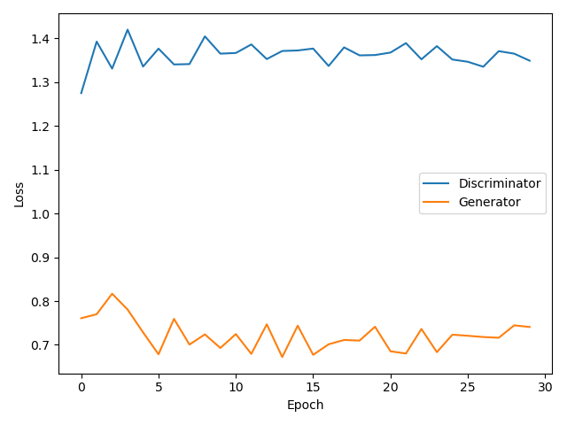

# Conditional GAN for MNIST Digit Generation

A TensorFlow/Keras implementation of a **Conditional Generative Adversarial Network (cGAN)** for synthesizing handwritten digits from the MNIST dataset. The model enables controlled generation of specific digit classes (0-9) through label conditioning.

## Overview

This project implements a conditional GAN architecture where both the generator and discriminator are conditioned on class labels. Unlike vanilla GANs that generate random samples, this cGAN allows users to specify which digit to generate, enabling precise control over the synthesis process.

**Key Features:**
- Class-conditional image generation (digits 0-9)
- DCGAN-inspired architecture with batch normalization and transposed convolutions
- Reproducible training with fixed random seeds
- Comprehensive visualization of training progress
- Keras 3 compatible weight management

## Architecture

### Generator
The generator transforms random noise vectors into realistic 28×28 digit images:

- **Input:** 100-dimensional latent vector `z` + class label `y`
- **Conditioning:** 50-dimensional embedding layer for class labels
- **Architecture:**
  - Dense layer (7×7×256 feature maps)
  - Batch normalization + ReLU activation
  - Two transposed convolutional blocks with stride-2 upsampling
  - Final layer with `tanh` activation → outputs in [-1, 1]
- **Output:** 28×28×1 grayscale image

### Discriminator
The discriminator classifies images as real or fake while considering class information:

- **Input:** 28×28×1 image + class label `y`
- **Conditioning:** Label embedded as a 28×28 spatial mask (concatenated as second channel)
- **Architecture:**
  - Two convolutional blocks with stride-2 downsampling
  - LeakyReLU (α=0.2) activation + 30% dropout
  - Fully connected layer → single logit output
- **Output:** Real/fake classification logit

## Training Details

### Hyperparameters
```python
Latent dimension (z_dim):     100
Batch size:                   128
Epochs:                       30
Learning rate (G & D):        2e-4
Adam beta_1:                  0.5
Loss function:                Binary Cross-Entropy (from logits)
```

### Training Strategy
1. **Discriminator Update:** Train D to classify real images as 1 and generated images as 0
2. **Generator Update:** Train G to fool D (make D classify fake images as 1)
3. **Label Randomization:** Both real and fake batches use random class labels to prevent mode collapse
4. **Data Preprocessing:** Images scaled to [-1, 1] to match generator's `tanh` output range

### Dataset
- **Source:** MNIST training split (60,000 images)
- **Usage:** Unsupervised/generative setting (labels used only for conditioning, not classification)
- **Preprocessing:** Normalization to [-1, 1], shape expansion to (28, 28, 1)

## Project Structure

```
MINST Digit Generation/
├── train_gan.py              # Main training script
├── evaluation.py             # Model evaluation and weight management
├── models/
│   ├── generator.json        # Generator architecture (JSON)
│   ├── generator.h5          # Generator weights (legacy format)
│   └── generator.weights.h5  # Generator weights (Keras 3 format)
├── outputs/
│   ├── generated.png         # Final 5×5 sample grid
│   ├── eval_generated.png    # Evaluation sample grid
│   ├── loss_plot.png         # Training loss curves
│   ├── generated_epoch_*.png # Per-epoch sample grids (30 files)
│   ├── z_eval.npy            # Saved latent vectors for reproducibility
│   └── labels_eval.npy       # Saved labels for reproducibility
├── generated.png             # Quick reference sample (root level)
└── loss_plot.png             # Quick reference loss plot (root level)
```

## Usage

### Training
Run the main training script to train the cGAN from scratch:

```bash
python train_gan.py
```

**Expected Output:**
- Per-epoch loss metrics printed to console
- Sample grids saved to `outputs/generated_epoch_*.png` after each epoch
- Final artifacts: trained generator model, loss plot, and sample grid


### Evaluation
Load the trained generator and generate new samples:

```bash
python evaluation.py
```

**Output:**
- Re-saves generator weights in Keras 3 format (`generator.weights.h5`)
- Generates a fresh 5×5 sample grid (`outputs/eval_generated.png`)
- Ensures weight compatibility across Keras versions

### Custom Generation
To generate specific digits programmatically:

```python
import numpy as np
from tensorflow.keras import models

# Load generator
with open("models/generator.json", "r") as f:
    generator = models.model_from_json(f.read())
generator.load_weights("models/generator.weights.h5")

# Generate 10 samples of digit "7"
z = np.random.normal(size=(10, 100)).astype("float32")
labels = np.full((10, 1), 7, dtype=np.int32)  # All labels = 7
images = generator.predict([z, labels])

# Images are in [-1, 1], convert to [0, 1] for display
images = (images + 1.0) / 2.0
```

## Results

### Sample Outputs
The model successfully generates diverse, high-quality handwritten digits conditioned on class labels. Each row in the 5×5 grid corresponds to a different digit class (0-9 pattern repeated).

**Sample Grid (Epoch 30):**


### Training Dynamics
The loss plot shows typical GAN training behavior:
- **Discriminator Loss:** Stabilizes around 0.6-1.0 (balanced real/fake classification)
- **Generator Loss:** Converges to ~1.0-1.5 (successfully fools discriminator)

**Loss Curves:**


### Quality Progression
Samples improve significantly over 30 epochs:
- **Early epochs (1-5):** Noisy, blob-like shapes
- **Mid-training (10-20):** Recognizable digit structures emerge
- **Final epochs (25-30):** Sharp, realistic handwritten digits

## Technical Highlights

1. **Reproducibility:** Fixed random seeds (504) ensure consistent results across runs
2. **Keras 3 Compatibility:** Dual weight format support (`generator.h5` + `generator.weights.h5`)
3. **Efficient Data Pipeline:** `tf.data` API with shuffling and batching
4. **Monitoring:** Per-epoch sample grids enable visual tracking of training progress
5. **Modular Design:** Separate training and evaluation scripts for flexibility

## Requirements

```
tensorflow >= 2.13.0
numpy >= 1.24.0
matplotlib >= 3.7.0
```

**Installation:**
```bash
pip install tensorflow numpy matplotlib
```

**Note:** This implementation is compatible with TensorFlow 2.x and Keras 3.x.

## Implementation Notes

- **Batch Normalization:** Applied in generator (not discriminator) to stabilize training
- **Dropout:** 30% dropout in discriminator prevents overfitting to real data
- **Label Embedding:** Separate embedding strategies for G (concatenated vector) and D (spatial mask)
- **Activation Functions:** LeakyReLU for D (prevents dying neurons), ReLU for G, tanh for output
- **Optimizer:** Adam with β₁=0.5 (standard for GANs, reduces momentum oscillations)

## Future Enhancements

- Implement Wasserstein GAN (WGAN) loss for improved stability
- Add Fréchet Inception Distance (FID) metric for quantitative evaluation
- Extend to higher-resolution datasets (CIFAR-10, CelebA)
- Incorporate progressive growing or StyleGAN techniques
- Add interpolation visualization between digit classes

